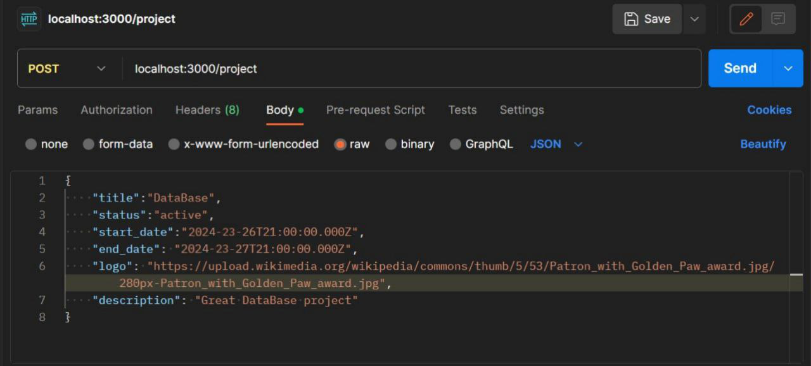
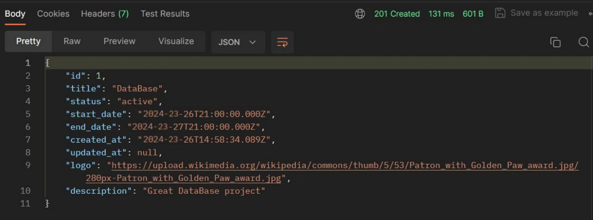
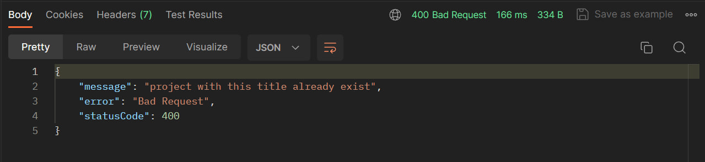
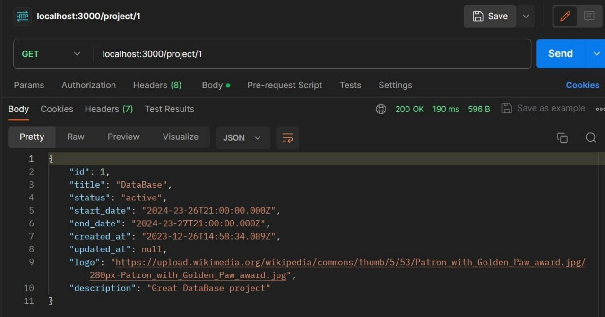
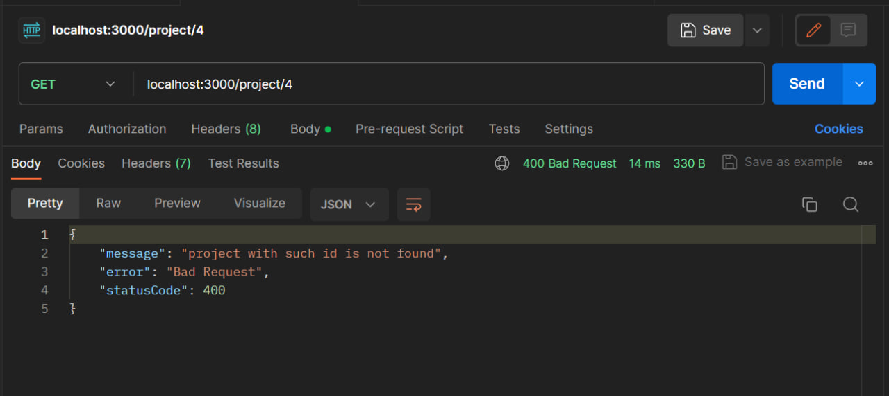
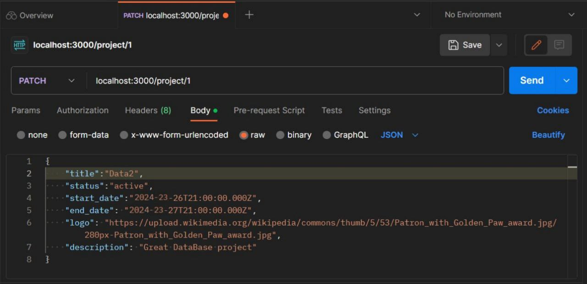
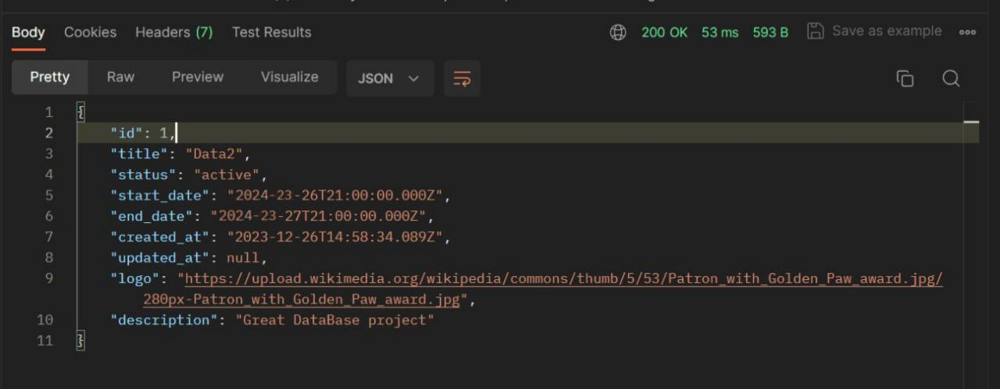
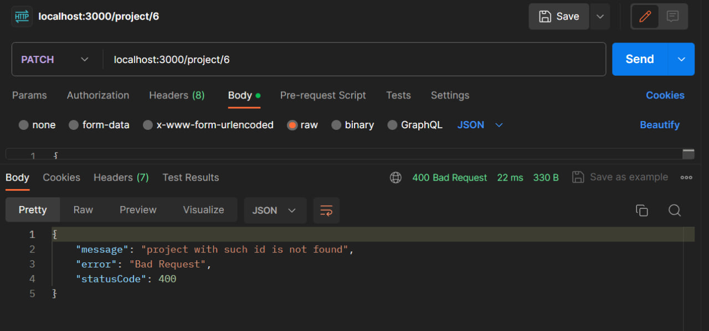
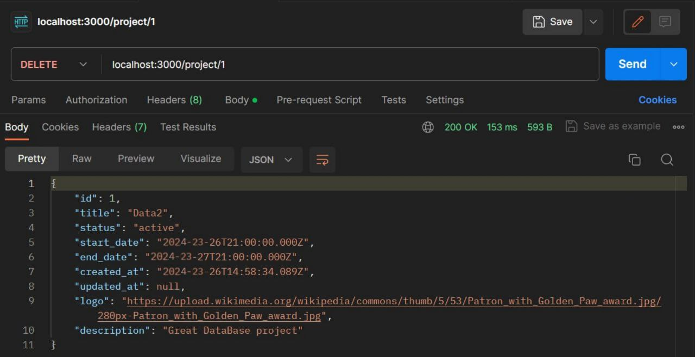
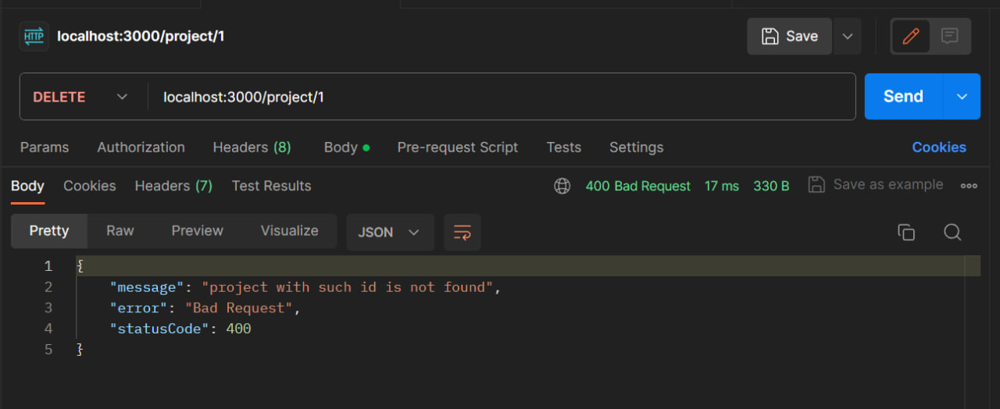

# Тестування працездатності системи

Тестування сервісу проводилося за допомогою застосунку [Postman](https://www.google.com/search?q=postman&rlz=1C1GCEA_enUA1034UA1034&oq=postman&gs_lcrp=EgZjaHJvbWUqCQgAEEUYOxiABDIJCAAQRRg7GIAEMgcIARAAGIAEMgcIAhAAGIAEMgcIAxAAGIAEMgcIBBAAGIAEMgcIBRAAGIAEMgcIBhAAGIAEMgcIBxAAGIAEMgcICBAAGIAEMgcICRAAGIAE0gEIMTA4NGowajeoAgCwAgA&sourceid=chrome&ie=UTF-8).

## Створення проєкту (метод POST)

### Запит на створення проєкту

### Відповідь на створення проєкту

### Спроба створити проєкт з помилковим часом

### Спроба створити проєкт з вже існуючою назвою

## Отримання проєкту (метод GET)

### Успішне отримання проєкту

### Помилка в отриманні проєкту

## Оновлення проєкту (метод PATCH)

### Запит на оновлення проєкту

### Відповідь на оновлення проєкту

### Помилка в оновленні проєкту

## Видалення користувача (метод DELETE)

### Успішне видалення проєкту

### Видалення неіснуючого проєкту

